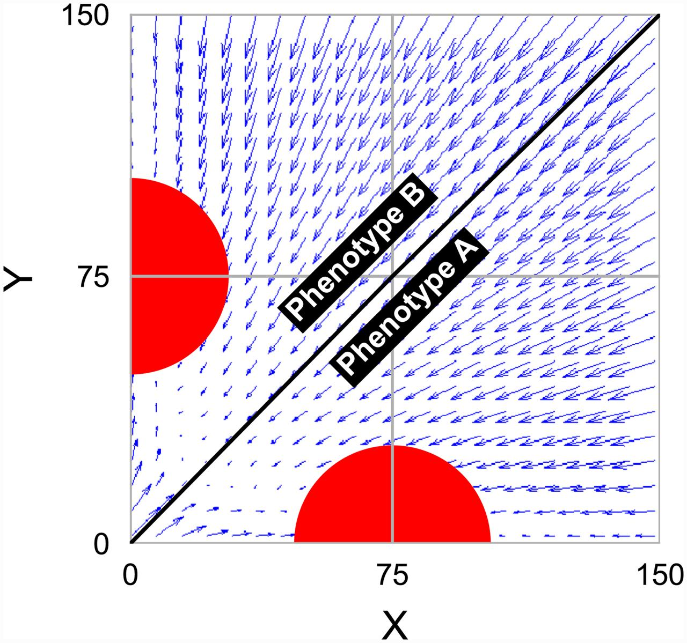

[Home](index.md) :: [Selected Publications](pub.md) :: [Google Scholar](https://scholar.google.com/citations?user=H-9OPuIAAAAJ&hl=en) :: [CV](Hadiseh_Safdari_CV.pdf) :: [linkedin](https://linkedin.com/in/hadiseh-safdari-238540153) 
## Selected publications 

### Noise-driven cell differentiation and the emergence of spatiotemporal patterns, Safdari, Kalirad, et al., 2020, _PLOS ONE_

**Summary**

This PLOS ONE research article presents a noise-driven differentiation
(NDD) model of cell differentiation and pattern formation. The model
incorporates intrinsic cellular noise, stochastic cell division, and cell
signaling to explain how phenotypic diversity emerges and leads to
spatiotemporal patterns in cell populations. Simulations using a cell
aggregation model support the model's predictions, showing that noise alone
can generate heterogeneity, while signaling introduces spatial order. The
authors compare their model to existing models, highlighting its unique
approach of separating and analyzing different noise sources. Finally, the
study discusses the implications of the NDD model for understanding the
evolutionary transition from unicellularity to multicellularity.

[https://doi.org/10.1371/journal.pone.0232060](https://journals.plos.org/plosone/article?id=10.1371/journal.pone.0232060)

Summaries were generated by [NotebookLM](https://notebooklm.google).