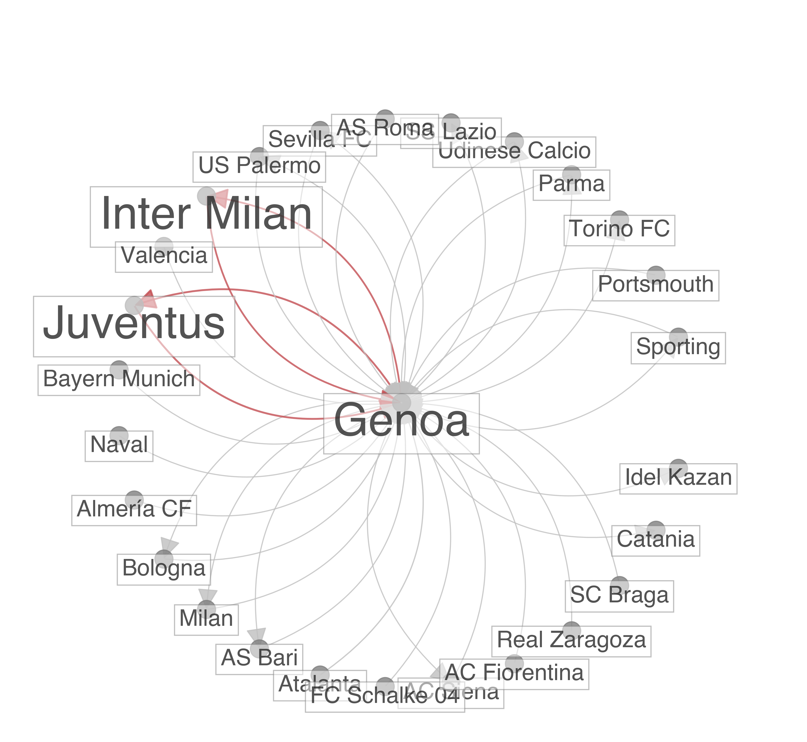
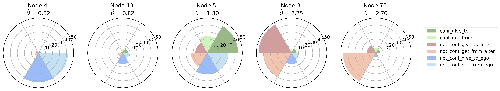
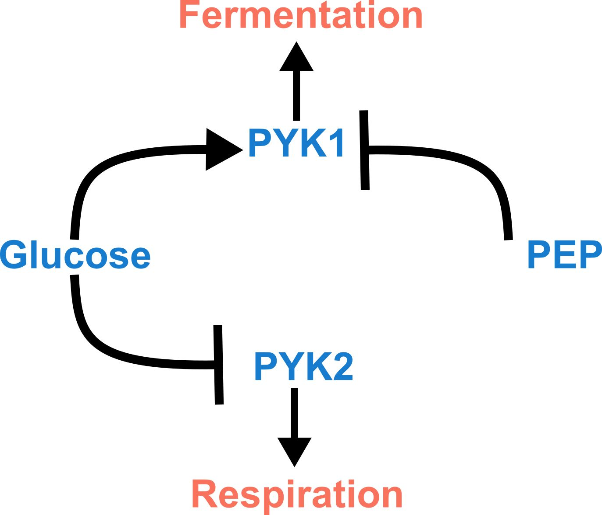

[Home](index.md) :: [Selected Publications](pub.md) :: [Google Scholar](https://scholar.google.com/citations?user=H-9OPuIAAAAJ&hl=en) :: [CV](Hadiseh_Safdari_CV.pdf) :: [linkedin](https://linkedin.com/in/hadiseh-safdari-238540153) 
## Selected publications 

### Community detection and anomaly prediction in dynamic networks

**Summary**

This research paper introduces DynACD, a novel probabilistic model for detecting anomalies in dynamic networks.
DynACD integrates community detection to establish a baseline of typical network behavior, 
identifying anomalies as deviations from this established structure. The model is evaluated on both synthetic and real-world datasets, 
demonstrating superior performance compared to existing methods. A case study using football player transfers showcases DynACD's ability 
to detect anomalies influenced by factors like club wealth and national leagues, as well as identify potential data errors. The model's 
probabilistic framework allows for the interpretation of anomaly detection results, enhancing its practical usability.

    
    
<em>Figure 1: Genoa transfer network. Visualization of player transfers to and from Genoa involving various clubs at different time steps. There is a consistent presence of transfers with Juventus and Inter Milan at most time steps, T, shown by red edges.
</em>

[DOI](https://doi.org/10.1038/s42005-024-01889-y) [GitHub](https://github.com/hds-safdari/DynACD)

### Generative Model for Reciprocity and Community Detection in  Directed Networks

**Summary**

This research paper introduces a novel probabilistic generative model, called CRep, designed to analyze and model reciprocity and community structure within directed networks. 
Unlike previous models that treat these aspects separately or make simplifying assumptions about edge independence, CRep incorporates both community memberships 
and a reciprocity parameter to more accurately represent the complex interplay between these factors in real-world networks. The model uses an 
efficient expectation-maximization algorithm for parameter inference and a benchmark generative model for synthetic data creation. 
The effectiveness of CRep is demonstrated through experiments on both synthetic and real-world datasets, showing superior 
performance in edge prediction and reproducing observed reciprocity values. The authors provide an open-source implementation of their code.
<!--  --> 

    
    
<em>Figure 2: Reciprocity Patterns in the Erasmus Network. This figure illustrates how different universities in the Erasmus student exchange network exhibit a range of 
    reciprocity patterns in their partnerships with other universities. The figure visualizes these patterns in terms of how the outgoing 
    edges of a given university are driven by academic preference versus the reciprocation of student exchanges from partner universities.
</em>

[DOI](https://doi.org/10.1103/PhysRevResearch.3.023209) [GitHub](https://github.com/mcontisc/CRep)
<!-- [https://github.com/hds-safdari/DynCRep](GitHub)  [https://latentnetworks.github.io/vimure/](GitHub) -->

### Latent Network Models to Account for Noisy, Multiply-Reported Social Network Data

**Summary**

This research article introduces VIMuRe, a new probabilistic model for analyzing noisy, multiply-reported social network data. 
The model accounts for individual reporter biases (over- or under-reporting) and "mutuality"—the tendency to report reciprocal relationships. 
VIMuRe's efficiency allows it to scale to large networks, utilizing variational inference. 
The model is validated through simulations and applied to two empirical datasets (Nicaragua and Karnataka), 
demonstrating improved accuracy in estimating network structure and reciprocity compared to traditional methods. 
The findings highlight the importance of considering mutuality and reporter reliability when interpreting social network data.

    
    
<em>Figure 3: Illustration of reporter reliability and tie confirmation in a social support network from a Nicaraguan community.
    Pie charts highlight different configurations of reported and confirmed ties for selected reporters, emphasizing variations in reporting behavior and mutuality.
</em>

[DOI](https://doi.org/10.1093/jrsssa/qnac004) [GitHub](https://latentnetworks.github.io/vimure/)

### Anomaly, reciprocity, and community detection in Static and Dynamic Networks

**Summary**

Anomaly detection is a foundational problem in the area of data analysis. In networked systems, where individual entities interact in pairs, anomalies are observed when patterns of interactions deviate from patterns considered regular. Properly defining what regularity means relies on developing expressive models for describing the observed interactions. This is crucial for tackling anomaly detection in networks. Among the many well-known models for networks, latent variable models - a class of probabilistic models - offer promising tools to capture the intrinsic features of the data. To this end, we proposed probabilistic generative approaches that incorporate domain knowledge, such as community membership and reciprocity, as a fundamental model for regular behavior in Networks, and thus flag potential anomalies deviating from this. Community membership shapes the building blocks of a null model to identify the normal interaction patterns. The structural information enters the model through latent variables for community membership and anomaly parameters. The algorithms aim at inferring these latent parameters and then output the labels identifying anomalies on the network objects (nodes/edges). In addition, we considered the situation where networks and anomalies evolve, as observed in realistic situations. Hence we developed a dynamic version of the model as well 
<!-- 
 -->
<!-- [safdari2024community,safdari2023anomaly,safdari2022anomaly]() -->

### Noise-driven cell differentiation and the emergence of spatiotemporal patterns, Safdari, Kalirad, et al., 2020, _PLOS ONE_

**Summary**

This PLOS ONE research article presents a noise-driven differentiation
(NDD) model of cell differentiation and pattern formation. The model
incorporates intrinsic cellular noise, stochastic cell division, and cell
signaling to explain how phenotypic diversity emerges and leads to
spatiotemporal patterns in cell populations. Simulations using a cell
aggregation model support the model's predictions, showing that noise alone
can generate heterogeneity, while signaling introduces spatial order. The
authors compare their model to existing models, highlighting its unique
approach of separating and analyzing different noise sources. Finally, the
study discusses the implications of the NDD model for understanding the
evolutionary transition from unicellularity to multicellularity. 

    
    
<em>Figure 4:  In a bistable switch, two attractors (red semicircles) and, consequently, two phenotypes are available: 
    A and B. The likelihood of a switch choosing state A over B depends on the number of the transcription factor associated with state A (TFX) 
    relative to the number of the transcription factor associated with state B (TFY), as well as the noise in its environment.
</em>

 

[DOI](https://doi.org/10.1371/journal.pone.0232060) [GitHub](https://github.com/hds-safdari/Noise_Driven_Cell_Differentiation)  

### Game theoretical approach to Metabolic pathways

**Summary**

This research paper uses computational modeling and game theory to investigate the Crabtree effect in yeast, 
focusing on the switch between fermentation and respiration for ATP production. The authors propose a metabolic 
switch model where individual yeast cells dynamically adjust their strategy based on glucose availability, 
resulting in population-level heterogeneity. This contrasts with traditional game-theoretical models that assume distinct 
subpopulations with fixed strategies. The study uses stochastic simulations to explore the model's behavior under varying 
glucose conditions and proposes an experimental method to distinguish between mixed-strategy and distinct-subpopulation scenarios. 
The findings could have implications for understanding cancer metabolism and developing new therapies.
<!--  -->

    
    
<em>Figure 5:  The proposed regulatory network imagines a simple switch between fermentation and respiration based on the experimental data.
</em>

[DOI](https://doi.org/10.1016/j.jtbi.2021.110912) [GitHub](https://github.com/Kalirad/Making_ATP_fast_and_slow)  

<!-- ### Scaled Brownian Motion

**Summary**

A stochastic process in anomalous diffusion, especially Scaled Brownian Motion (SBM) a highly non-stationary Gaussian process.  Characterizing statistical properties of models for anomalous diffusion is a crucial point in analyzing data received from single particle tracking measurements. Particularly, from both theory and simulation points of view, we studied aging effects (time-span between system preparation and the start of the measurements) on statistical features such as first passage time density and ergodicity behavior of confined and unconfined SBM. For aged SBM, ensemble-averaged mean squared displacement (MSD) which had power law dependence on time, tends to be the time-averaged MSD. This second average is particularly important for the analysis of single particle tracking data and it is at the heart of the phenomenon of ergodicity breaking. In particular, in the strong aging limit, they converge to each other and ergodicity is restored. Besides, confined SBM in the presence of aging is a unique process in which the ensemble average tends to plateau. For strong aging, again ergodicity is restored. Moreover, we investigated the ergodicity breaking parameter as a measure of scattering of different trajectories. We represented its full behavior for all values of anomalous exponent within a general approach, which could be applied to other anomalous processes. -->

Summaries were generated by [NotebookLM](https://notebooklm.google).