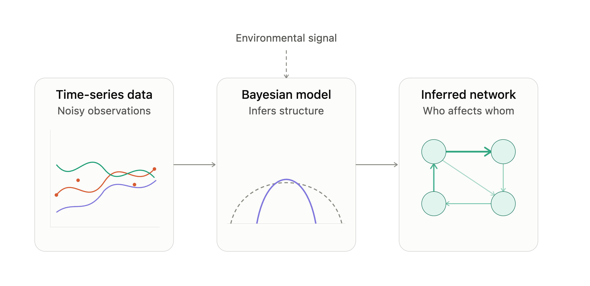
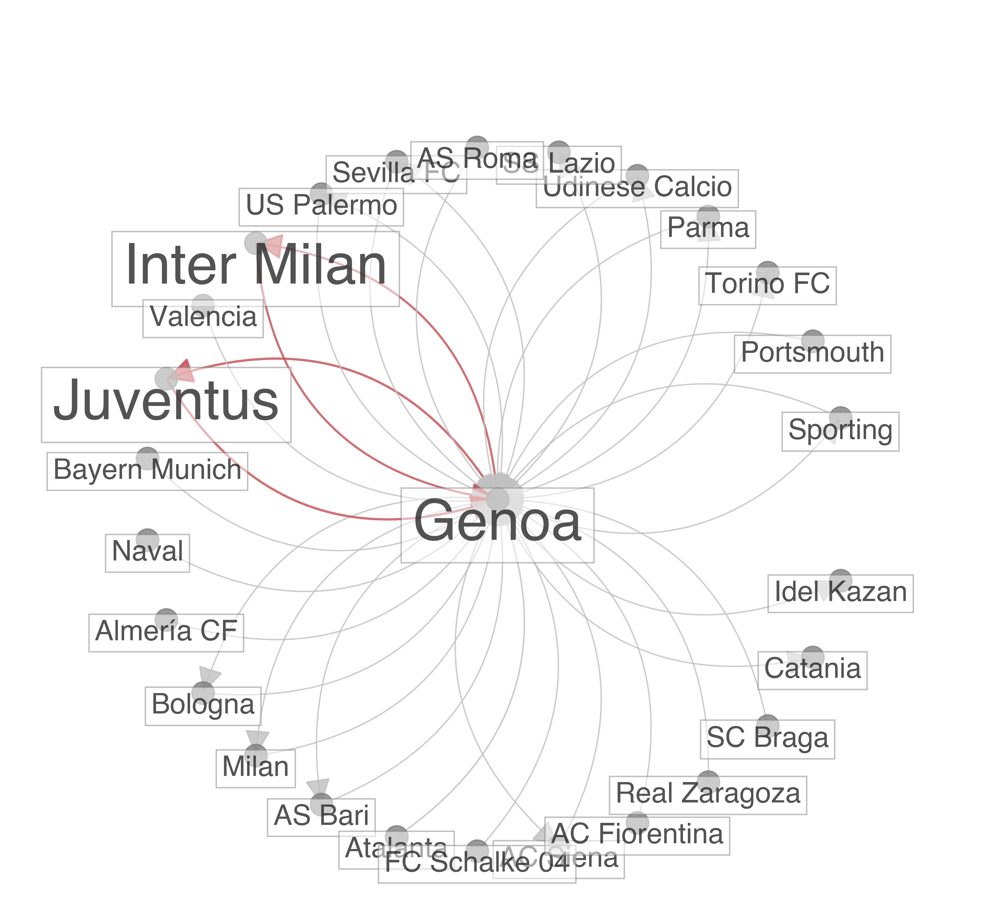
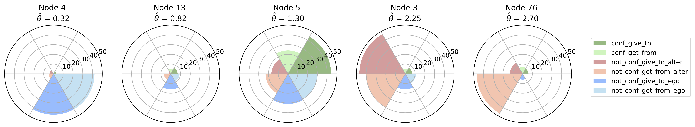
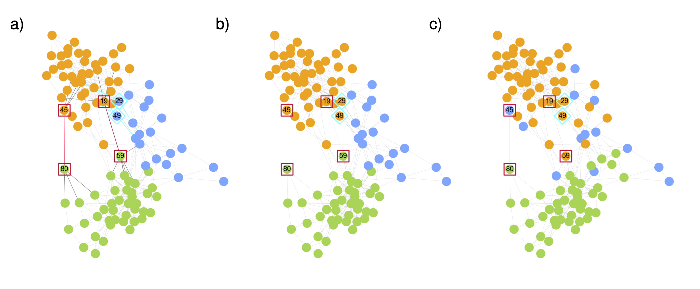
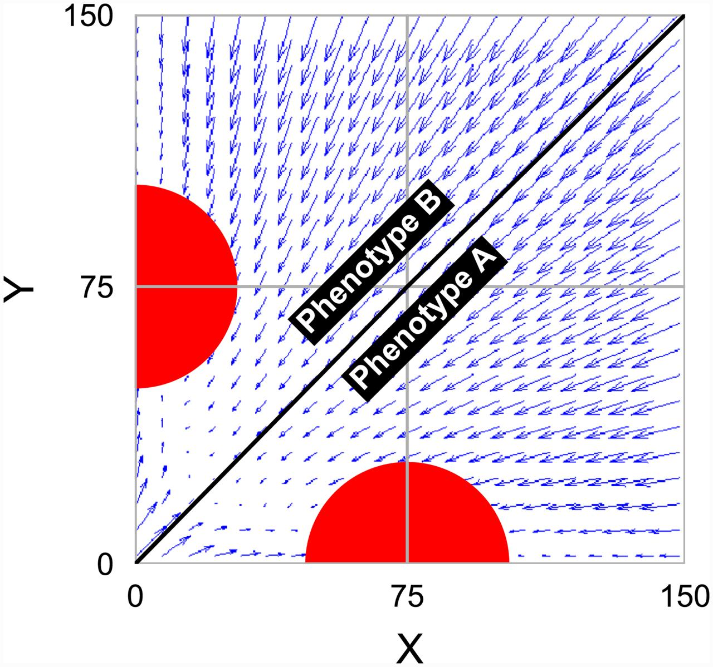
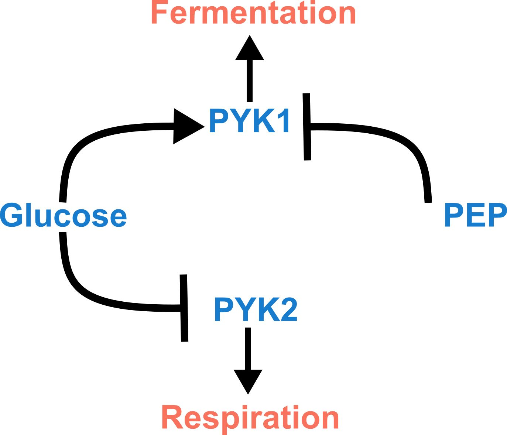

<section class="page-title">
  
Selected projects and publications

  <h1>Research at the interface of networks, inference, and dynamical systems.</h1>
  

    These projects share a common goal: using probabilistic generative models to recover interpretable structure from data that are noisy, biased, incomplete, or evolving.
  

</section>

  The project summaries below emphasize modeling ideas, scientific motivation, and reusable computational tools.

<section class="project-list">
  <article class="project-card" id="microbial-interactions">
    

      
Ongoing · Bayesian inference · Microbial ecology

      <h2 class="pub-title">Learning microbial interactions from time-series data</h2>
      

        Microbial communities are dense webs of interaction: species compete, cooperate, and reshape one another's fortunes as their environment shifts. But the data we collect on them is noisy, sparse, and shaped by the limits of what our instruments can measure.
      

      

        In this ongoing project, I am developing a Bayesian framework to infer how microbial species influence one another over time — and how those relationships respond to changing environmental conditions — directly from absolute-abundance time-series measurements. The approach is designed to handle the practical realities of such data, from measurement noise to detection limits, while keeping the inferred interactions interpretable and grounded in biological priors. The broader aim is to turn imperfect observational data into a principled, mechanistic picture of how a microbial ecosystem behaves. Manuscript in preparation.
      

      

        Bayesian modeling
        Time series
        Microbial communities
        Environmental context
      

    

    

      
      
Figure 1: From noisy microbial time series to a Bayesian model shaped by environmental context — recovering the hidden network of species interactions.

    

  </article>

  <article class="project-card" id="dynacd">
    

      
Communications Physics · Nature Portfolio · 2024

      <h2 class="pub-title">Anomaly detection in dynamic networks — DynACD</h2>
      

        Networks evolve, and so does what counts as unusual within them. DynACD is a probabilistic model that learns the community structure underlying a dynamic network and flags interactions that deviate from that learned baseline, turning anomaly detection into a principled statistical inference problem rather than a heuristic one.
      

      

        Beyond outperforming existing methods on synthetic and real-world benchmarks, the model's probabilistic framework makes its results interpretable: applied to two decades of player transfers among European football clubs, it revealed anomalies shaped by club wealth and league boundaries, and even surfaced likely errors in the data itself.
      

      

        <a href="https://doi.org/10.1038/s42005-024-01889-y">Paper</a>
        <a href="https://github.com/hds-safdari/DynACD">GitHub</a>
      

    

    

      
      
Figure 2: Genoa transfer network. Player transfers to and from Genoa, including recurring connections with Juventus and Inter Milan.

    

  </article>

  <article class="project-card" id="crep">
    

      
Physical Review Research · 2021

      <h2 class="pub-title">Reciprocity and community structure in directed networks — CRep</h2>
      

        If someone sends you a connection, how likely are you to send one back — and how does that tendency interact with the communities you belong to? Most models treat reciprocity and community structure separately, or assume network edges form independently. CRep breaks with both assumptions: it is a generative model that captures their joint effect, with an efficient expectation-maximization algorithm for inference and a companion benchmark for generating synthetic networks with tunable reciprocity.
      

      

        The result is markedly better edge prediction and networks that reproduce the reciprocity patterns actually observed in real data. The implementation is open source.
      

      

        <a href="https://doi.org/10.1103/PhysRevResearch.3.023209">Paper</a>
        <a href="https://github.com/mcontisc/CRep">GitHub</a>
      

    

    

      
      
Figure 3: Reciprocity patterns in the Erasmus student exchange network.

    

  </article>

  <article class="project-card" id="vimure">
    

      
Journal of the Royal Statistical Society Series A · 2023

      <h2 class="pub-title">Inferring social networks from noisy, conflicting reports — VIMuRe</h2>
      

        When you ask two people about the same relationship, they often disagree. VIMuRe is a latent network model that treats survey-based social network data as what it really is — noisy, multiply-reported observations — and infers the underlying network while accounting for each reporter's tendency to over- or under-report, as well as mutuality in how ties are described.
      

      

        Built on variational inference, it scales to large networks, and applications to village datasets from Nicaragua and Karnataka show substantially more accurate estimates of network structure and reciprocity than conventional approaches. This project, a collaboration with statisticians and social scientists, underscores a central theme of my work: the measurement process is part of the model.
      

      

        <a href="https://doi.org/10.1093/jrsssa/qnac004">Paper</a>
        <a href="https://latentnetworks.github.io/vimure/">Project</a>
      

    

    

      
      
Figure 4: Reporter reliability and tie confirmation in a Nicaraguan social support network.

    

  </article>

  <article class="project-card" id="acd">
    

      
Journal of Big Data · 2022

      <h2 class="pub-title">Anomaly detection and community detection in networks</h2>
      

        This work presents a probabilistic generative model for anomaly detection in networks, ACD, leveraging community structure to define regular interaction patterns. The model incorporates latent variables representing community memberships and anomalous edges, enabling simultaneous inference of both.
      

      

        An expectation-maximization algorithm efficiently estimates these variables, and the model's performance is validated using synthetic and real-world datasets. Experiments demonstrate improved community detection by removing or adding edges identified as anomalies, showcasing the model's flexibility and robustness.
      

      

        <a href="https://doi.org/10.1186/s40537-022-00669-1">Paper</a>
        <a href="https://github.com/hds-safdari/Anomaly_Community_Detection">GitHub</a>
      

    

    

      
      
Figure 5: Enhanced community detection through the removal of anomalous edges in the POLBOOKS network.

    

  </article>

  <article class="project-card" id="ndd">
    

      
PLOS ONE · 2020

      <h2 class="pub-title">Noise-driven cell differentiation and the emergence of spatiotemporal patterns</h2>
      

        This interdisciplinary research project develops a noise-driven differentiation model of cell differentiation and pattern formation. The model incorporates intrinsic cellular noise, stochastic cell division, and cell signaling to explain how phenotypic diversity emerges and leads to spatiotemporal patterns in cell populations.
      

      

        Simulations using a cell aggregation model support the model's predictions, showing that noise alone can generate heterogeneity, while signaling introduces spatial order. The study discusses the implications of the model for understanding the evolutionary transition from unicellularity to multicellularity.
      

      

        <a href="https://doi.org/10.1371/journal.pone.0232060">Paper</a>
        <a href="https://github.com/hds-safdari/Noise_Driven_Cell_Differentiation">GitHub</a>
      

    

    

      
      
Figure 6: A bistable switch with two phenotypic attractors.

    

  </article>

  <article class="project-card" id="metabolic-pathways">
    

      
Journal of Theoretical Biology · 2021

      <h2 class="pub-title">Game theoretical approach to metabolic pathways</h2>
      

        This research paper uses computational modeling and game theory to investigate the Crabtree effect in yeast, focusing on the switch between fermentation and respiration for ATP production. The authors propose a metabolic switch model where individual yeast cells dynamically adjust their strategy based on glucose availability, resulting in population-level heterogeneity.
      

      

        This contrasts with traditional game-theoretical models that assume distinct subpopulations with fixed strategies. The study uses stochastic simulations to explore the model's behavior under varying glucose conditions and proposes an experimental method to distinguish between mixed-strategy and distinct-subpopulation scenarios.
      

      

        <a href="https://doi.org/10.1016/j.jtbi.2021.110912">Paper</a>
        <a href="https://github.com/Kalirad/Making_ATP_fast_and_slow">GitHub</a>
      

    

    

      
      
Figure 7: A regulatory switch between fermentation and respiration.

    

  </article>
</section>
